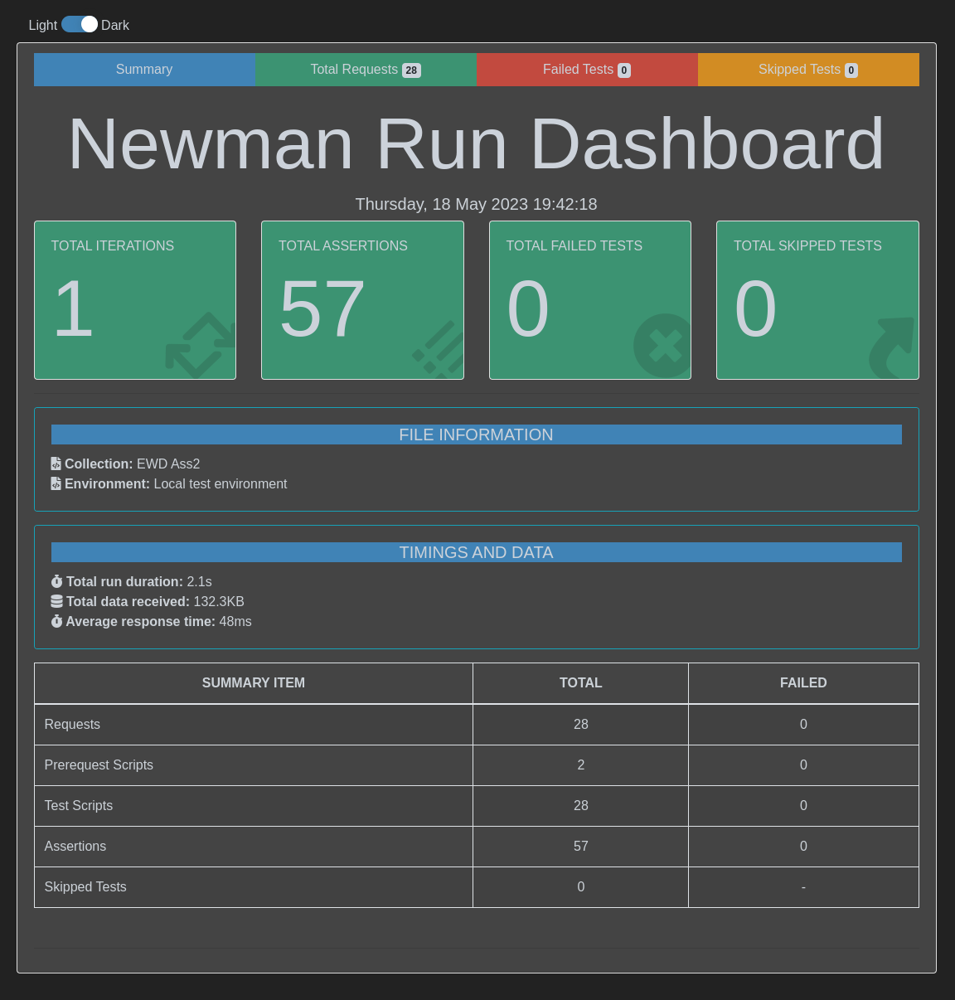

# Assignment 2 - Web API.

Name: Cathal O'Connor

## Features.

- Feature 1 - Get Similar Movies: Get a list of similar movies using a movie ID.  
- Feature 2 - Get Movie Images: Get a list of images for a movie using a movie ID.
- Feature 3 - Get Recommended Movies: Get a list of similar movies using a movie ID.
- Feature 4 - Get Movie Credits: Get a list of actors in the movie using a movie ID.

#### Added TV Shows Section to api which included the below features along with similar feature movies started with from the labs
- Feature 5 - Get Similar TVShows: Get a list of similar TV Shows using a TV Show ID.  
- Feature 6 - Get TVShows Images: Get a list of images for a TV Show using a TV Show ID.
- Feature 7 - Get popular TVShows: Get a list of popular TV Shows using a TV Show ID.
- Feature 8 - Get Recommended TVShows: Get a list of recommended TV Shows using a TV Show ID.
- Feature 9 - Get TVShows Credits: Get a list of actors for a TV Show using a TV Show ID.

#### Added Actors Section to api
- Feature 10 - Get Actor By Id: Get actor details by actor id
- Feature 11 - Get Actor images by Id: Get a list of images for an actor using an actor id 

#### Added Reviews Section to api
- Feature 12 - Get Movie Reviews: Get a list of reviews for movies using a movie ID. Reviews come from TMDB and mongodb if any are added through this api
- Feature 13 - Add Movie Review: Add a movie review to mongo db using a movie Id
- Feature 14 - Get TVShow Reviews: Get a list of reviews for tvshows using a movie ID. Reviews come from TMDB and mongodb if any are added through this api
- Feature 15 - Add TVShow Review: Add a TV Show review to mongo db using a TV Show Id


## Installation Requirements

This api is built using Github Codespaces/DevContainer. The files required are located in the .devcontainer folder. Instuctions on how to use are located here https://code.visualstudio.com/docs/devcontainers/containers


To contribute or test this software you can run the commands below. 
```cmd
git clone https://github.com/CathalOConnorRH/ewd-api-labs-2023.git
```
Then enter the project directory 
```
cd ewd-api-labs-2023
```
and change branch to the assignment2 branch 
```
git checkout assignment2
```
followed by installation

```bat
npm install
```

To run the api server, run the following command and access the [api](http://localhost:8080) from this list when it's running
```bat
npm start
```


## API Configuration

Before running this project you will need to create a `.env` file in the root directory and fill in the information below. 

The key `MY_WRITE_KEY` is the api key from https://segment.com/ and is required for analytics of key functions being requested. 

```bat
NODE_ENV=development
PORT=8080
HOST=localhost
DATABASE_DIALECT=mongo
TMDB_KEY=<TMDB_API_KEY>
DATABASE_URL=mongodb://<MONGO_DB_URL>
JWT_SECRET_KEY=<JWT_SECRET_KEY>
MY_WRITE_KEY=<SEGMENT_API_KEY>
```

## API Design

[Give an overview of your web API design, perhaps similar to the following: ]

|                                         | GET                                                      | POST                            | PUT                | DELETE |
| --------------------------------------- | -------------------------------------------------------- | ------------------------------- | ------------------ | ------ |
| /api/metrics                            | Gets metrics from the container/server                   | N/A                             | N/A                |        |
| /api/docs                               | Gets the swagger documentation                           | N/A                             | N/A                |        |
| /api/accounts                           | Gets a list of accounts                                  | Creates an account              | Updates an account |        |
| /api/accounts/security/token            | N/A                                                      | Gets the security token         | N/A                |        |
| /api/accounts/{accountId}/favourites    | Gets the favourites for the account                      | Adds favourites for the account | N/A                |        |
| /api/movies/                            | Get list of movies                                       | N/A                             | N/A                | N/A    |
| /api/movies/{movieid}                   | Get a movie                                              | N/A                             | N/A                | N/A    |
| /api/movies/{movieid}/images            | Get list of images for a movie                           | N/A                             | N/A                | N/A    |
| /api/movies/{movieid}/similar           | Get list of similar movies                               | N/A                             | N/A                | N/A    |
| /api/movies/{movieid}/recommendations   | Get list of recommended movies based on selected movie   | N/A                             | N/A                | N/A    |
| /api/tvshows/                           | Get a list of tvshows                                    | N/A                             | N/A                | N/A    |
| /api/tvshows/{tvshowid}                 | Get a tvshow                                             | N/A                             | N/A                | N/A    |
| /api/tvshows/{tvshowid}/images          | Get a list of images for a tvshow                        | N/A                             | N/A                | N/A    |
| /api/tvshows/{tvshowid}/similar         | Get a list of similar tvshows                            | N/A                             | N/A                | N/A    |
| /api/tvshows/{tvshowid}/recommendations | Get list of recommended tvshows based on selected tvshow | N/A                             | N/A                | N/A    |
| /api/person/{personid}                  | Get details for actor                                    | N/A                             | N/A                | N/A    |
| /api/person/{personid}/images           | Get a list of images for an actor                        | N/A                             | N/A                | N/A    |
| /api/reviews/movies/{movieid}           | Get all reviews for movie                                | Create a new review for Movie   | N/A                | N/A    |
| /api/reviews/tvshows/{tvshowid}         | Get all reviews for tvshow                               | Create a new review for tvshow  | N/A                | N/A    |
| /api/genres/                            | Get a list of genres                                     | Create a genre                  | N/A                | N/A    |
| /api/genres/genreid}                    | Get a genre by id                                        | N/A                             | N/A                | N/A    |

[Swaggerhub](https://app.swaggerhub.com/apis/CATOCONN/ewd/1.0.0-oas3)


## Security and Authentication

All routes above bar `/api/metrics`, `/api/docs` and `/api/accounts` (create account and verify account only) are protected by JWT authentication routes taken from the labs. 

## Validation

Extra validation is implemented in the post reviews route. This is to ensure reviews have author details and a review within certain limits. 

## Testing

Testing is done through the use of `postman` manually and then through `newman`
Once the api server is running, in a new terminal run the below command to rerun the tests. 

```bat
npm test
```
Test results can be seen in the tests folder or [here](http://localhost:8080/reports/report.html) which is served by the api server. 



## Integrating with React App

The react fronend end from assignment 1 was updated so that all previous requests were using this api. 
That included updating authentication and reviews to create and update etc on this api. 

Reviews are created in the mongodb for this api and are appended to the reviews array returned from TMDB. 

The main updates are made on the branch `assignment2` and api changes can be seen [here](https://github.com/CathalOConnorRH/EWD-Assignment1/blob/Assignment2/src/api/tmdb-api.js)

```Javascript
export const getTVShow = (id) => {
    return fetch(
        `/api/tvshows/${id}`, {
        headers: {
            'Authorization': window.localStorage.getItem('token')
        }
    })
        .then(res => res.json());
};
```


## Extra features

Containerization has been implemented as part of this repo also. 
To build the container you are required to have either `docker` or `podman` isntalled. 

The command to build the container is below, where image_tag is the name you want to give the container image. If you are going to push to a different registry other than docker hub eg. [quay.io](https://quay.io) you will need to include your registry in the image tag. 
```bat
docker build -t <image_tag> .
```
Once the image is build you can push it to the registry
```bat
docker push <image_tag>
```
Or run locall 
```bat
docker run <image_tag> --name <container_name>
```
For the purposes of the demo, the containers for both the frontend, backend and mongodb were hosted on a VPS in linode.

## Independent learning.

This project uses a number of different middlewares for various features. 
- Feature 1 - Logging of HTTP requests using [Morgan](https://www.npmjs.com/package/morgan)
- Feature 2 -  Use of [Winston](https://www.npmjs.com/package/winston) to enable error handling and  Logging in a structured format which incorporates [Morgan](https://www.npmjs.com/package/morgan) to ensure all logs follow a format and are stored/logged in sch a way that they can be injested into platforms that allow for analytics and automation using the logs (eg. [splunk](https://www.splunk.com/)). Logs are writen to a combined log file and a error specific file, and to the console. 
- Feature 3 - Use of prom-client, a prometheus client for node that gathers and exports metrics which can be used to analyse server/container and node performance. These metrics are gathered every 30 secs (configurable) then forwarded to grafana cloud and graphed. THe JSON for the dashboard is in the GrafanaDashboard.json file. This was available online as part of the prom-client. 
- Feature 4 - There was an attemp to use swagger autogen but it does not work with how the routes are generated currently. [`github issue`](https://github.com/davibaltar/swagger-autogen/issues/150). Swagger was manually generated and uploaded to [swaggerhub](https://app.swaggerhub.com/apis/CATOCONN/ewd/1.0.0-oas3), it is also available in the swagger-output.<jsoin/yaml> file in this repo. The json is served by the api under http://localhost:8080/docs/
- Feature 5 - Request ananlytics was implemented using Segment, this allows us to recored and analyse request details. This was added to certain key requests and not all requests for traffic/api limit purposes.

